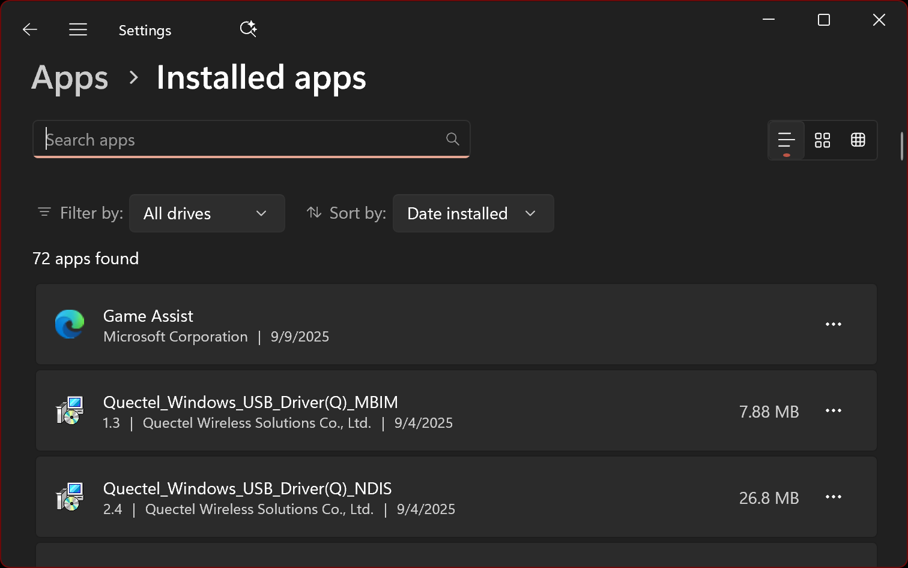
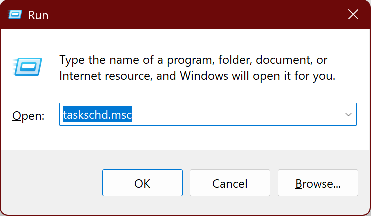
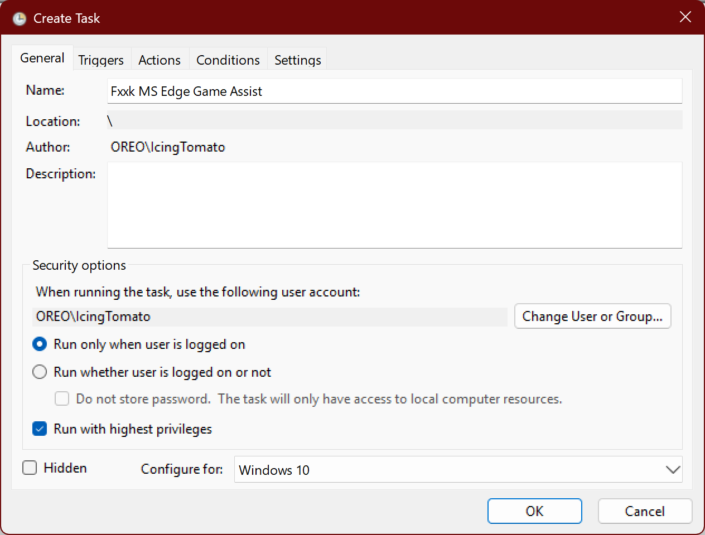
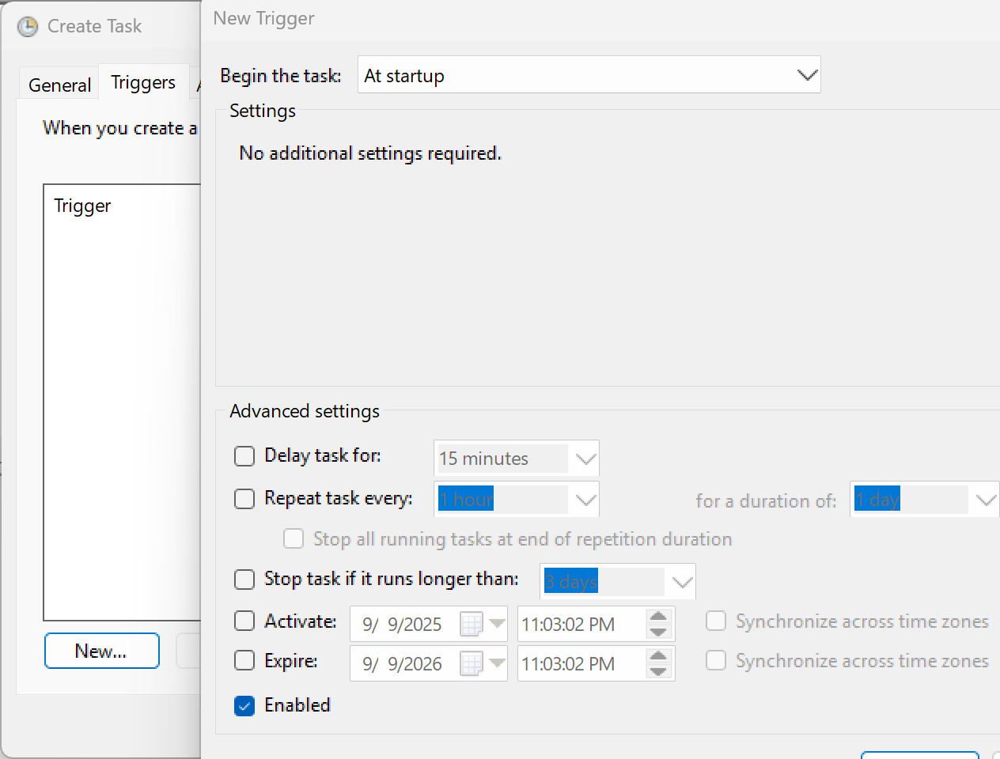
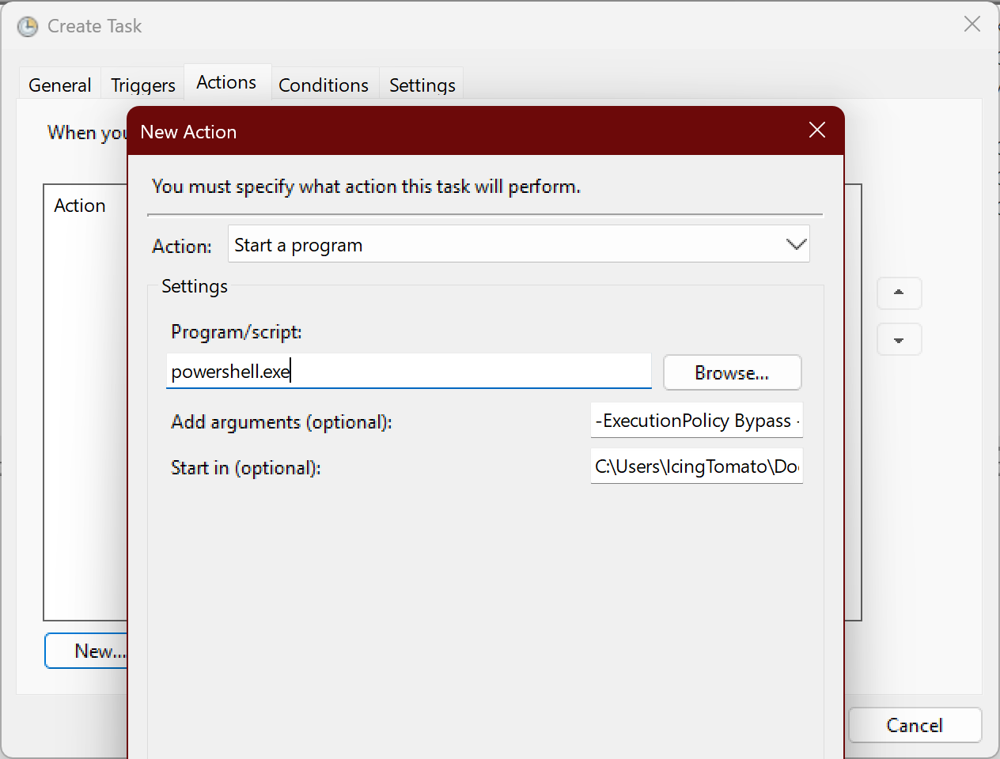
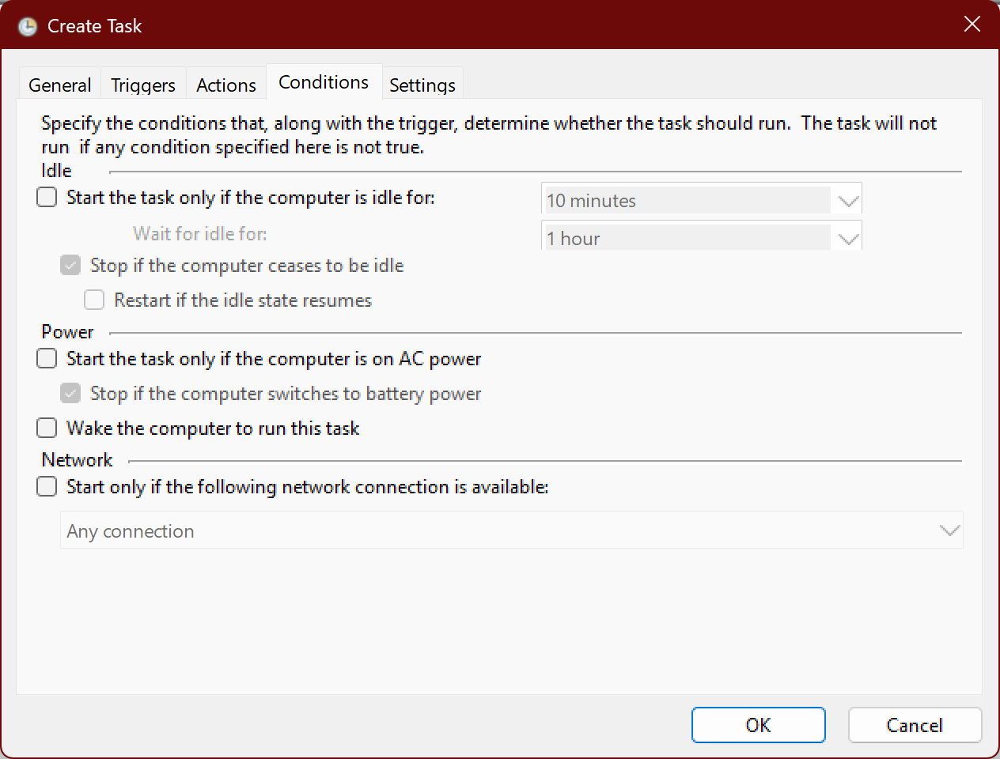
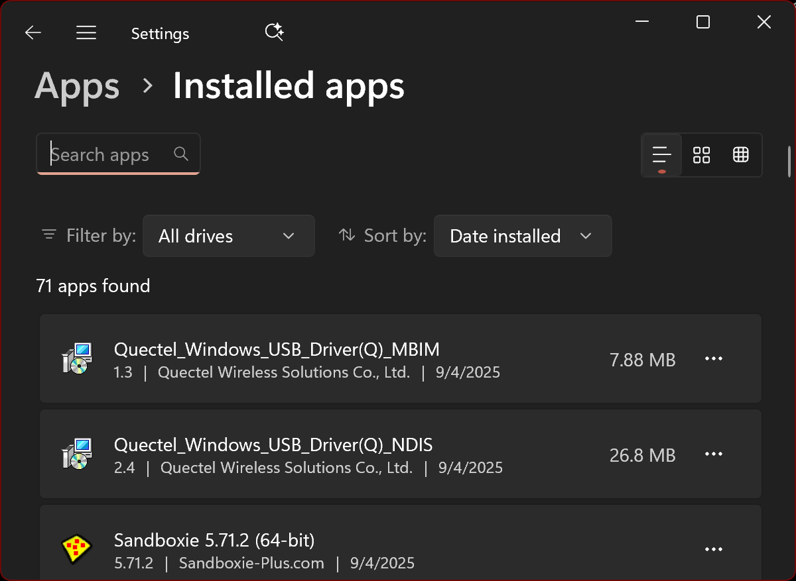

# Fuck Microsoft Edge Game Assist

> I don’t need to be redirected to a browser to look up guides when I’m playing games. Moreover, Microsoft doesn’t give users the option to choose and force-installs Game Assist, which is very frustrating for me.

## Tutorial

1. Check Game Assist installation


2. Open Task Scheduler
    - Press Win + R → type taskschd.msc → press Enter.


3. Create a New Task
    - Click Create Task (not “Create Basic Task”) on the right-hand side.

4. General Settings
    - Name it: Run fuck-ms.ps1 at startup
    - Check Run with highest privileges.
    - Configure for: select your version of Windows.


5. Trigger Settings
    - Go to the Triggers tab → click New.
    - Choose At startup → click OK.


6. Action Settings
    - Go to the Actions tab → click New.
    - Action: Start a program.
    -  Program/script: `powershell.exe`
    - Add arguments: `-ExecutionPolicy Bypass -File "Path\to\your\script\fuck-ms.ps1"`
    - Start in (optional): `Path\to\your\script`


7. Conditions/Settings
    - Uncheck options like “Start the task only if the computer is on AC power” or “Start only if the computer is idle.”


8. Save the Task
    - Click OK
    - Restart your computer to test if the script runs at startup.


## Script

Just: 

```powershell
Get-AppxPackage -AllUsers -Name Microsoft.Edge.GameAssist | Remove-AppxPackage 
```